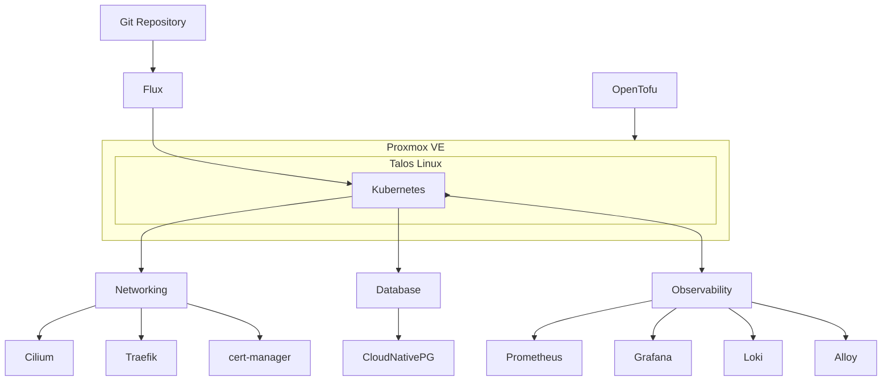

<div align="center">

# HX Kubelab

**An experimental [Kubernetes](https://kubernetes.io/) platform built with [Talos Linux](https://www.talos.dev/) and [Flux](https://fluxcd.io/).**

[](#project-status)
[](https://github.com/Hovirix/kubelab/actions/workflows/checks.yml)
[](https://github.com/Hovirix/kubelab/actions/workflows/security.yml)

</div>

HX Kubelab preserves my previous Kubernetes-based implementation of [HX Lab](https://github.com/Hovirix/homelab).

It is no longer the production platform. The implementation remains available as a complete Kubernetes reference and as a foundation for future experimentation.

---

## Contents

* [Background](#background)
* [Architecture](#architecture)
* [Platform](#platform)
* [Repository](#repository)
* [Operations](#operations)
* [Project Status](#project-status)
* [License](#license)

## Background

Kubelab started as an attempt to run the complete homelab platform on Kubernetes.

The architecture worked, but Kubernetes did not match the goals of the production homelab. Feature development required more supporting infrastructure, baseline resource usage was higher, and the additional operational complexity provided limited benefit for the workloads being hosted.

The production platform therefore moved to [Docker Swarm](https://docs.docker.com/engine/swarm/) with a stronger focus on simplicity, resource efficiency, fast recovery, and minimal operational overhead.

The Kubernetes implementation was moved here rather than deleted so it can remain useful for experimentation and future projects.

## Architecture



## Platform

| Layer          | Technology                                                                                              | Role                        |
| -------------- | ------------------------------------------------------------------------------------------------------- | --------------------------- |
| Virtualization | [Proxmox VE](https://www.proxmox.com/en/proxmox-virtual-environment/overview)                           | Kubernetes compute          |
| Provisioning   | [OpenTofu](https://opentofu.org/)                                                                       | Infrastructure provisioning |
| Node OS        | [Talos Linux](https://www.talos.dev/)                                                                   | Immutable Kubernetes nodes  |
| Orchestration  | [Kubernetes](https://kubernetes.io/)                                                                    | Container orchestration     |
| GitOps         | [Flux](https://fluxcd.io/)                                                                              | Cluster reconciliation      |
| Networking     | [Cilium](https://cilium.io/)                                                                            | Kubernetes networking       |
| Routing        | [Gateway API](https://gateway-api.sigs.k8s.io/) + [Traefik](https://traefik.io/traefik/)                | Application ingress         |
| Certificates   | [cert-manager](https://cert-manager.io/)                                                                | Certificate lifecycle       |
| Database       | [CloudNativePG](https://cloudnative-pg.io/)                                                             | PostgreSQL lifecycle        |
| Metrics        | [Prometheus](https://prometheus.io/)                                                                    | Metrics collection          |
| Dashboards     | [Grafana](https://grafana.com/)                                                                         | Observability               |
| Logs           | [Loki](https://grafana.com/oss/loki/) + [Alloy](https://grafana.com/oss/alloy-opentelemetry-collector/) | Log collection              |

## Repository

```text
.
├── infrastructure/
│   └── opentofu/        # Proxmox and Talos infrastructure
├── platform/
│   ├── clusters/        # Flux cluster reconciliation
│   ├── database/        # CloudNativePG and PostgreSQL
│   ├── networking/      # Cilium, Traefik, certificates
│   └── observability/   # Metrics, dashboards, and logs
├── operations/
│   ├── scripts/         # Operational automation
│   └── taskfiles/       # Task workflows
├── .github/workflows/   # CI and security checks
├── Taskfile.yml         # Operational interface
├── flake.nix            # Development environment
└── AGENTS.md            # Architecture and agent context
```

Git remains the source of truth for both infrastructure and cluster state. Flux reconciles the Kubernetes platform from the declarations under `platform/`.

## Operations

[Task](https://taskfile.dev/) provides the repository operational interface.

The current Taskfile groups workflows around:

```text
cluster:*      Kubernetes and Talos lifecycle
tofu:*         OpenTofu infrastructure
checks:*       Repository validation
security:*     Security validation
update:*       Dependency and platform updates
```

A reproducible development environment is provided through [Nix](https://nixos.org/).

## Project Status

**Inactive / experimental.**

Kubelab is not the active HX Lab platform and is not currently intended for production deployment.

Development moved to [`Hovirix/homelab`](https://github.com/Hovirix/homelab), which uses Docker Swarm as the production orchestrator.

This repository is retained to:

* preserve the Kubernetes implementation;
* provide a reference for Talos, Flux, Cilium, and Kubernetes patterns;
* support future Kubernetes experiments;
* allow the architecture to be resumed without starting again from scratch.

## License

Distributed under the [MIT License](LICENSE).

